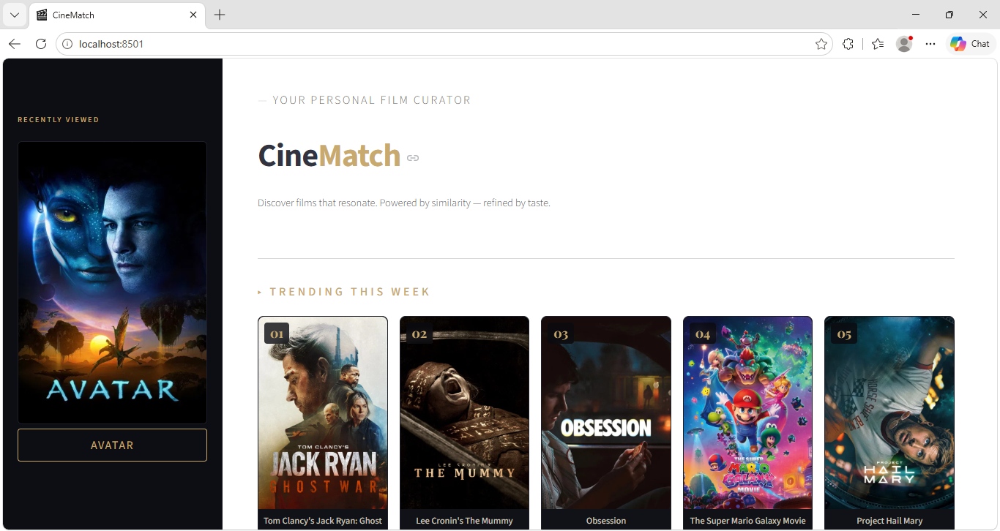
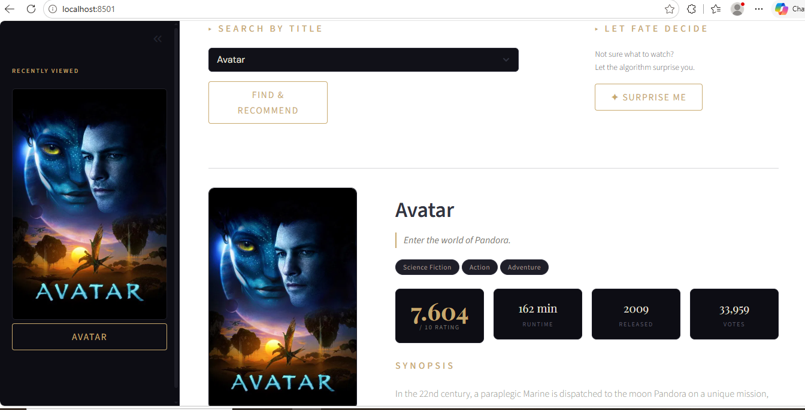

# 🎬 CineMatch — Personalized Movie Recommender

<div align="center">


**A content-based movie recommendation engine with a cinematic dark UI.**  
Search any film, get 5 similar picks — or let the algorithm surprise you.

</div>

---

## ✨ Features

- **Smart Recommendations** — Content-based filtering using cosine similarity on movie metadata (genres, cast, crew, keywords)
- **Live Movie Data** — Posters, trailers, cast photos, ratings, budgets and more pulled from the TMDB API
- **Trending Section** — Shows the top 5 trending movies of the week via TMDB
- **Surprise Me** — Picks a random movie from the dataset and shows full details + recommendations
- **Watch History** — Sidebar tracks your last 5 viewed movies with one-click revisit
- **Cinematic UI** — Custom dark theme with Playfair Display typography and gold accents

---

## 📸 Preview

**Hero & Trending Section**


**Movie Detail View — Ratings, Tagline & Synopsis**


**Recommendations & Trailer Links**


---

## 🗂️ Project Structure

```
cinematch/
├── app.py                        # Main Streamlit application
├── Movie_Recommender.ipynb       # Data processing & model building notebook
├── requirements.txt              # Python dependencies
│
├── model_files/                  # Generated by the notebook (not tracked in git)
│   ├── movie_list.pkl            # Processed movie DataFrame
│   └── similarity.pkl            # Cosine similarity matrix
│
├── dataset/                      # Raw TMDB dataset (not tracked in git)
│   ├── tmdb_5000_movies.csv
│   └── tmdb_5000_credits.csv
│
└── .streamlit/
    └── secrets.toml              # API key config (not tracked in git)
```

---

## ⚙️ Setup & Installation

### 1. Clone the repository

```bash
git clone https://github.com/your-username/cinematch.git
cd cinematch
```

### 2. Install dependencies

```bash
pip install -r requirements.txt
```

### 3. Get a TMDB API key

1. Create a free account at [themoviedb.org](https://www.themoviedb.org/)
2. Go to **Settings → API** and request a key
3. Create the secrets file:

```bash
mkdir .streamlit
```

```toml
# .streamlit/secrets.toml
[tmdb]
api_key = "your_api_key_here"
```

### 4. Download the dataset

Download the TMDB 5000 Movie Dataset from [Kaggle](https://www.kaggle.com/datasets/tmdb/tmdb-movie-metadata) and place both CSV files inside a `dataset/` folder:

```
dataset/
├── tmdb_5000_movies.csv
└── tmdb_5000_credits.csv
```

### 5. Generate the model files

Open and run **`Movie_Recommender.ipynb`** top to bottom. This will create:
- `model_files/movie_list.pkl`
- `model_files/similarity.pkl`

### 6. Run the app

```bash
streamlit run app.py
```

The app opens automatically at `http://localhost:8501`.

---

## 🧠 How It Works

The recommendation engine uses **content-based filtering**:

1. **Feature Engineering** — Movie metadata (overview, genres, keywords, cast, crew) is combined into a single text "tag" per movie.
2. **Vectorization** — Tags are converted into numerical vectors using `CountVectorizer` with stemming via NLTK.
3. **Similarity** — Cosine similarity is computed between all movie vectors, producing a matrix saved as `similarity.pkl`.
4. **Recommendation** — When you pick a movie, the top 5 most similar movies (by cosine score) are returned.

```
User selects movie
       │
       ▼
  Look up index in movie_list.pkl
       │
       ▼
  Fetch similarity row from similarity.pkl
       │
       ▼
  Sort by score → top 5 results
       │
       ▼
  Fetch posters + trailers from TMDB API
```

---

## 📦 Dependencies

| Package | Purpose |
|---|---|
| `streamlit` | Web application framework |
| `requests` | HTTP calls to TMDB API |
| `pandas` | Data manipulation |
| `numpy` | Numerical operations |
| `scikit-learn` | CountVectorizer + cosine similarity |
| `nltk` | Text stemming |
| `pickle` | Model serialization |
| `urllib3` | Retry logic for HTTP requests |

---

## 🔒 Environment & .gitignore

Make sure you **never commit** your API key or large model files. Add this to your `.gitignore`:

```gitignore
# Secrets
.streamlit/secrets.toml

# Model files (large binaries)
model_files/

# Raw dataset
dataset/

# Python cache
__pycache__/
*.pyc
.env
```

---

## 🚀 Deploying to Streamlit Cloud

1. Push your repo to GitHub (without `model_files/` and `dataset/`)
2. Go to [share.streamlit.io](https://share.streamlit.io) and connect your repo
3. Under **Advanced Settings → Secrets**, paste:
   ```toml
   [tmdb]
   api_key = "your_api_key_here"
   ```
4. Add a `setup.sh` or use `@st.cache_resource` to regenerate model files on first run, or commit the `.pkl` files separately via [Git LFS](https://git-lfs.github.com/)

---

## 🙌 Credits

- Movie data — [TMDB API](https://www.themoviedb.org/documentation/api)
- Dataset — [Kaggle TMDB 5000 Movie Dataset](https://www.kaggle.com/datasets/tmdb/tmdb-movie-metadata)
- Built with [Streamlit](https://streamlit.io)

---

<div align="center">
Made with ♥ by <strong>Atif Yousafzai</strong>
</div>
